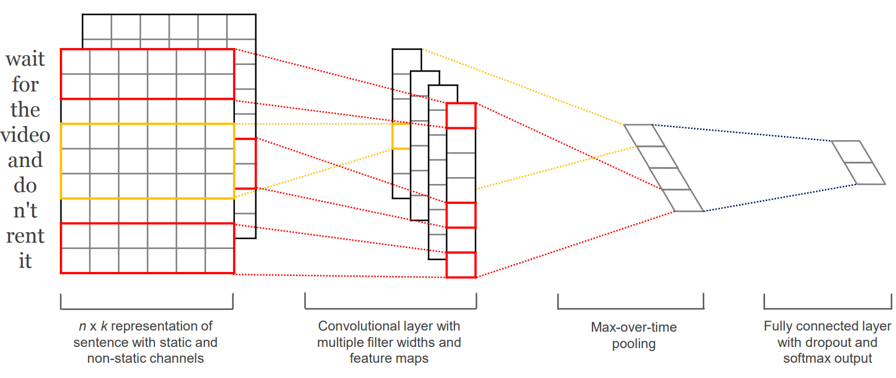
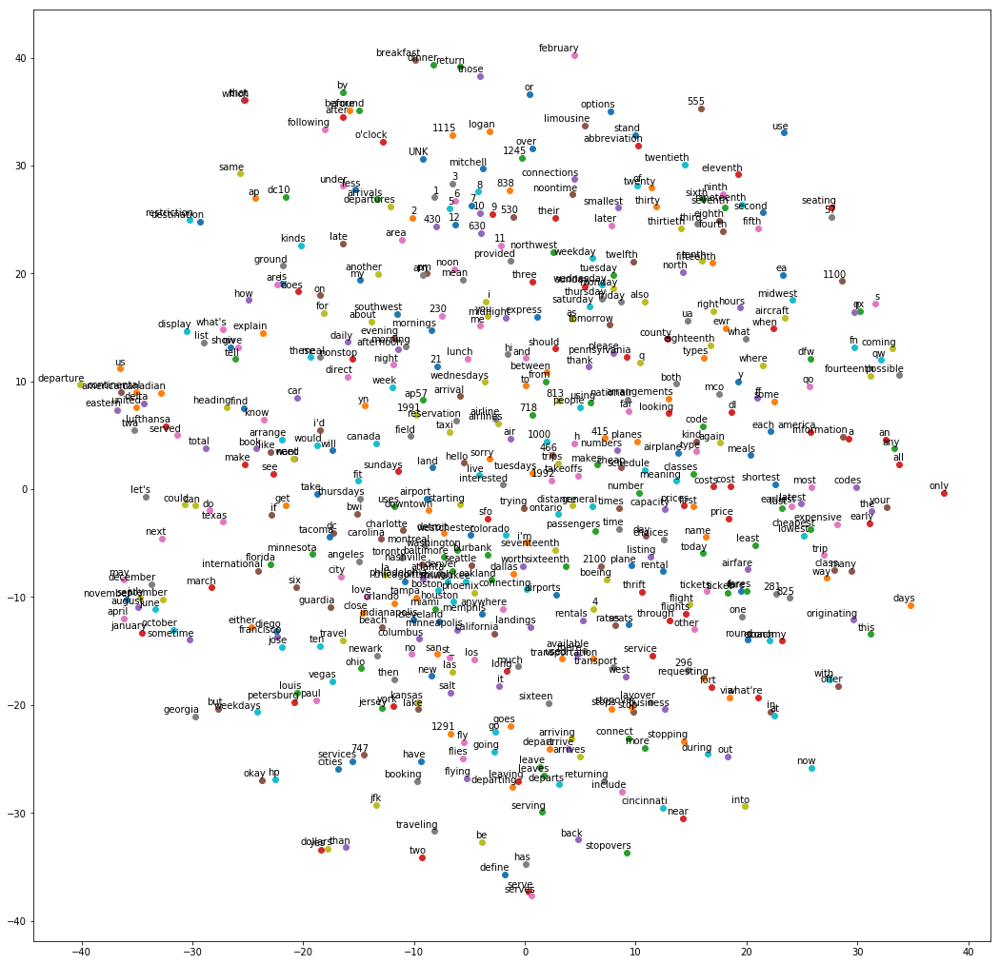

# utterance-classification

Classifying Airline Travel Information System (ATIS) utterances with the word2vec and convolutional neural network architecture described in [[1]](http://www.aclweb.org/anthology/D14-1181)

## 2D representation of word2vec embedding

